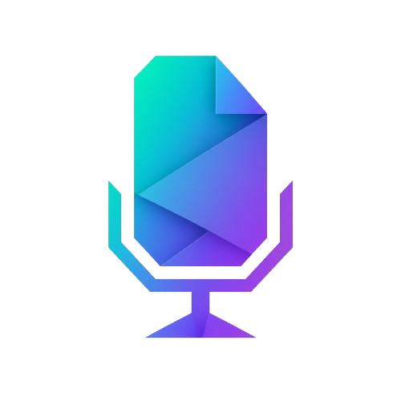

<p align="center">
  
</p>

<h1 align="center">Meeting Notes</h1>

<p align="center">
  Grave reuniões, transcreva automaticamente e gere resumos, pontos-chave e tarefas com IA — tudo local, sem servidores externos.
</p>

<p align="center">
  
  
  
  
</p>

---

## O que é

**Meeting Notes** é um aplicativo desktop para Windows que automatiza o registro de reuniões. Ele captura o áudio do sistema ou microfone, transcreve a fala usando o modelo Whisper localmente e passa o conteúdo para Claude (Anthropic) ou GPT-4 (OpenAI), que produz automaticamente:

- Um **resumo** estruturado em parágrafos
- **Pontos-chave** extraídos da conversa
- **Tarefas** com responsável, prazo e prioridade

Tudo fica armazenado em SQLite no próprio computador. Nenhum dado de reunião é enviado a servidores externos — as únicas chamadas de rede são para a API de IA configurada.

---

## Instalação rápida

1. Baixe o instalador na [página de releases](https://github.com/L-Bellei/meeting-notes/releases/latest)
2. Execute `meeting-notes-2.2.3-windows-amd64-installer.exe`
3. Abra o **Meeting Notes** pelo menu Iniciar ou pelo ícone na área de trabalho
4. Na primeira abertura, acesse **Configurações** (ícone de engrenagem) e insira sua chave de API

> **GPU NVIDIA** com drivers CUDA ≥ 12.4 é recomendado para transcrição rápida. O app funciona em CPU, mas é significativamente mais lento para modelos `medium` e `large`.

---

## Tela de carregamento

Ao iniciar, o app exibe uma tela de carregamento com três verificações sequenciais:

| Verificação | O que valida |
|---|---|
| **Servidor HTTP** | Backend Go está ouvindo na porta alocada |
| **Modelo de transcrição** | Serviço Python carregou o Whisper na memória |
| **Chave da API** | Chave configurada é válida (testada com uma chamada mínima) |

A interface principal só é exibida após todas as verificações passarem. Se o modelo de transcrição demorar (primeira execução, carregamento em GPU), o app continua funcional — reuniões podem ser criadas enquanto o modelo ainda carrega.

---

## Funcionalidades

### Gravação de reuniões

- Captura de áudio via **loopback do sistema** (o que está sendo reproduzido) ou **microfone**
- Usa WASAPI (Windows Audio Session API) via PyAudioWPatch — compatível com Windows 10 e 11
- Inicie uma gravação pela **toolbar**, pelo **atalho global** ou pelo **menu do system tray**
- Um widget de sobreposição (overlay Win32) aparece sobre outras janelas durante a gravação, permitindo parar sem voltar ao Meeting Notes
- O status da gravação é sincronizado em tempo real via eventos Wails

**Atalho global padrão:** `Ctrl + Shift + R` (configurável em Configurações)

### Transcrição automática

- Motor: [faster-whisper](https://github.com/SYSTRAN/faster-whisper) (CTranslate2 + OpenAI Whisper)
- Modelos disponíveis:

| Modelo | Velocidade | Precisão | VRAM aprox. |
|---|---|---|---|
| `tiny` | ⚡⚡⚡⚡⚡ | ★☆☆☆☆ | ~400 MB |
| `base` | ⚡⚡⚡⚡ | ★★☆☆☆ | ~600 MB |
| `small` | ⚡⚡⚡ | ★★★☆☆ | ~1 GB |
| `medium` | ⚡⚡ | ★★★★☆ | ~3 GB |
| `large` | ⚡ | ★★★★★ | ~6 GB |

- Idiomas suportados: **Português**, **Inglês**, **Espanhol** e **auto-detecção**
- Aceleração automática: o app detecta CUDA na inicialização e usa GPU se disponível, com fallback para CPU

### Geração por IA

Ao parar a gravação, o pipeline executa automaticamente (quando `auto_generate` está ativado):

```
Parar gravação
  → Transcrever (Whisper)
  → Gerar Resumo        (Claude / GPT)
  → Gerar Pontos-chave  (Claude / GPT)
  → Gerar Tarefas       (Claude / GPT)
    → Criar card no Kanban (se o tema tiver auto-add ativado)
  → status: concluída
```

**Provedores suportados:**

| Provedor | Modelos |
|---|---|
| **Anthropic** | `claude-sonnet-4-6`, `claude-opus-4-7`, `claude-haiku-4-5` |
| **OpenAI** | `gpt-4o`, `gpt-4o-mini`, `gpt-4-turbo` |

Você pode **reprocessar** uma reunião a qualquer momento (botão "Reprocessar") para regenerar resumo, pontos e tarefas com um modelo diferente ou após editar a transcrição.

### Temas e categorias

Temas são categorias hierárquicas (pai → filho) que organizam suas reuniões:

- **Cor personalizada** — exibida nos badges da interface
- **Prompt personalizado** — substitui o prompt padrão da IA para todas as reuniões do tema (ex.: "foque em decisões técnicas e riscos de arquitetura")
- **Auto-add ao board** — ao concluir o processamento, cria automaticamente um card no Kanban para a reunião
- Temas podem ter **subtemas** para hierarquias mais granulares (ex.: `Projeto Alpha > Sprint 12`)

### Kanban Board

Visualize reuniões processadas como cards em um quadro Kanban:

- **Colunas configuráveis** — crie, renomeie, reordene e exclua colunas
- **Drag-and-drop** — mova cards entre colunas e reordene dentro da mesma coluna ([@dnd-kit](https://dndkit.com))
- **Cards automáticos** — criados pelo pipeline ao concluir uma reunião (quando o tema tem auto-add)
- **Cards manuais** — crie cards independentes de reuniões (backlog pessoal)
- **Detalhes do card** — exibe resumo, pontos-chave e tarefas da reunião vinculada
- **Filtros** — por título, número do card e intervalo de datas
- Numeração sequencial e imutável (estilo issue tracker)

### Busca global

Pressione `Ctrl + K` em qualquer tela para abrir a busca full-text:

- Busca em **transcrições**, **resumos**, **pontos-chave** e **tarefas** de todas as reuniões
- Resultados com **snippets** do trecho relevante e destaque do termo buscado
- Clique em um resultado para navegar diretamente para a reunião

### Notas em Markdown

Cada reunião possui um editor de notas com:

- Renderização de **Markdown completo** (GFM — tabelas, listas de tarefas, código)
- **Toolbar de formatação** para negrito, itálico, títulos, listas e código
- Salvo automaticamente ao sair do campo

### Transcrição manual

Você pode colar ou digitar uma transcrição sem precisar gravar. Útil para:

- Importar legendas ou atas de reuniões externas
- Corrigir erros de transcrição automática antes de reprocessar

### System Tray

O app minimiza para o system tray ao fechar a janela (não encerra o processo):

- **Clique** no ícone para reabrir a janela
- **Clique direito** exibe menu: Abrir, Iniciar/Parar gravação, Sair
- Tooltip indica se há uma gravação em andamento

---

## Configurações

Acesse pelo ícone de engrenagem na toolbar. Todas as configurações são persistidas localmente.

### Provedor de IA

Escolha entre **Anthropic** e **OpenAI**. A chave de API é validada ao salvar (uma chamada mínima ao endpoint do provedor confirma se é válida).

### Whisper

| Configuração | Opções | Descrição |
|---|---|---|
| Modelo | `tiny` / `base` / `small` / `medium` / `large` | Tamanho do modelo. Alterar requer reiniciar o app |
| Idioma | `pt` / `en` / `es` / `auto` | Idioma das reuniões. `auto` detecta automaticamente |
| Dispositivo | `auto` / `cuda` / `cpu` | `auto` usa GPU se disponível |

### Gravação

| Configuração | Descrição |
|---|---|
| Atalho global | Tecla de atalho para iniciar/parar gravação. Suporta `ctrl`, `shift`, `alt`, `win` + letra |
| Template de nome | Padrão para o título das reuniões. Variáveis: `{date}` (DD/MM/AAAA), `{time}` (HH:MM) |

### Auto-geração

Quando ativado, executa o pipeline completo (transcrição + IA) automaticamente ao parar a gravação. Desative para processar reuniões manualmente.

---

## Fluxo de uso típico

```
1. Abrir Meeting Notes
2. Criar um tema (ex.: "Stand-up diário" com cor verde)
3. Clicar em Gravar ou pressionar Ctrl+Shift+R
4. Escolher título e tema → Iniciar
5. Conduzir a reunião normalmente
6. Pressionar Ctrl+Shift+R novamente (ou usar o overlay) para parar
7. Aguardar: transcrição → resumo → pontos → tarefas (automático)
8. Revisar os resultados na aba da reunião
9. Editar as notas em Markdown se necessário
10. Visualizar no Kanban Board se auto-add estiver ativo no tema
```

---

## Arquitetura

```
┌──────────────────────────────────────────────┐
│              Wails Desktop App               │
│   React 19 + TypeScript (frontend)           │
│   Go HTTP server (backend, porta aleatória)  │
└──────────────┬───────────────────────────────┘
               │ HTTP (localhost)
               │
        ┌──────▼──────┐        ┌─────────────────────┐
        │  Go API     │        │   Python Service    │
        │  chi v5     │◄──────►│   FastAPI           │
        │  SQLite     │        │   faster-whisper    │
        │  AI clients │        │   PyAudioWPatch     │
        └─────────────┘        └─────────────────────┘
```

### Backend (Go)

```
cmd/
  desktop/    → Wails app: lifecycle, roteamento, tray, overlay Win32
  api/        → Servidor HTTP standalone (porta 8080, para desenvolvimento)

internal/
  ai/         → DynamicAIClient → AnthropicClient / OpenAIClient
  audio/      → Cliente HTTP para o serviço Python
  config/     → Variáveis de ambiente e .env
  database/   → Conexão SQLite + migrations automáticas (embed)
  handlers/   → Handlers HTTP por domínio
  models/     → Structs de domínio
  repository/ → CRUD por entidade (SQLite)
  services/   → Orchestrator, SummaryService, BoardColumnService, …
```

### Pipeline de processamento

O `Orchestrator` executa em goroutine após parar a gravação:

```
StopRecording (áudio)
  → Transcribe (Whisper via Python service)
  → GenerateSummary  ──┐
  → GenerateKeyPoints  ├── paralelo, se auto_generate = true
  → GenerateTasks    ──┘
    → CreateBoardCard (se theme.auto_add_to_board = true)
  → status = completed
```

Notificações de progresso são emitidas via eventos Wails para o frontend em tempo real.

### Banco de dados

SQLite em `%AppData%\Meeting Notes\meeting-notes.db`. Migrations aplicadas automaticamente na inicialização — nenhuma ação manual necessária.

```
themes          id, name, color, parent_id, custom_prompt, auto_add_to_board
meetings        id, theme_id, title, status, transcript, notes, started_at, duration_seconds
summaries       id, meeting_id, content, model_used, input_tokens, output_tokens
key_points      id, meeting_id, position, content
tasks           id, meeting_id, description, assignee, due_date, priority, completed
settings        key, value
board_columns   id, name, position
board_cards     id, meeting_id, column_id, number, position, description
app_logs        id, level, component, message, created_at
```

---

## Desenvolvimento

### Pré-requisitos

| Ferramenta | Versão | Finalidade |
|---|---|---|
| [Go](https://go.dev) | 1.22+ | Backend |
| [Node.js](https://nodejs.org) | 20+ | Frontend |
| [Wails CLI](https://wails.io/docs/gettingstarted/installation) | v2 | Build desktop |
| [Python](https://python.org) | 3.11+ | Serviço de áudio |
| [NSIS](https://nsis.sourceforge.io) | qualquer | Gerar instalador |

### Setup

```bash
# 1. Clonar
git clone https://github.com/L-Bellei/meeting-notes.git
cd meeting-notes

# 2. Serviço de áudio Python
cd audio-service
python -m venv .venv
.venv\Scripts\activate
pip install -r requirements.txt
uvicorn main:app --port 8765

# 3. Modo de desenvolvimento (em outro terminal, na raiz)
wails dev
```

O Wails inicia o servidor Go e o frontend Vite com hot-reload. O serviço Python precisa estar rodando separadamente.

### Variáveis de ambiente

Crie um `.env` na raiz (copiando `.env.example`):

```env
ANTHROPIC_API_KEY=sk-ant-api03-...
ANTHROPIC_MODEL=claude-sonnet-4-6
AUDIO_SERVICE_URL=http://localhost:8765
HTTP_PORT=8080
WHISPER_LANGUAGE=pt
WHISPER_MODEL=medium
WHISPER_DEVICE=auto
WHISPER_COMPUTE_TYPE=auto
```

> Em produção (instalador), o `.env` fica em `%AppData%\Meeting Notes\.env`. As configurações também podem ser gerenciadas inteiramente pela interface gráfica.

### Servidor HTTP standalone

```bash
# Sem Wails — útil para testar a API isoladamente
go run ./cmd/api/...
```

### Testes

```bash
# Go
go test ./...

# TypeScript (verificação de tipos)
cd frontend && npx tsc --noEmit
```

### Build do instalador

```powershell
# Com NSIS no PATH
cd cmd/desktop
$env:PATH += ";C:\Program Files (x86)\NSIS"
wails build -nsis

# Copiar para dist/
Copy-Item "build\bin\Meeting Notes-amd64-installer.exe" `
  "..\..\dist\meeting-notes-2.2.3-windows-amd64-installer.exe"
```

---

## API REST

### Saúde

| Método | Rota | Descrição |
|---|---|---|
| `GET` | `/health` | Status do servidor (`model_loaded`) |
| `GET` | `/api/ai/health` | Valida se a chave de IA está configurada e funcional |

### Temas

```
GET    /api/themes
POST   /api/themes
GET    /api/themes/{id}
PUT    /api/themes/{id}
DELETE /api/themes/{id}
```

### Reuniões

```
GET    /api/meetings              ?theme_id= &status= &created_after= &created_before=
POST   /api/meetings
GET    /api/meetings/{id}
PUT    /api/meetings/{id}
DELETE /api/meetings/{id}
POST   /api/meetings/{id}/start
POST   /api/meetings/{id}/stop
POST   /api/meetings/{id}/process
POST   /api/meetings/{id}/transcript
```

### Conteúdo gerado (padrão idêntico para `summary`, `key_points`, `tasks`)

```
GET    /api/meetings/{id}/summary
POST   /api/meetings/{id}/summary
PUT    /api/meetings/{id}/summary
DELETE /api/meetings/{id}/summary
POST   /api/meetings/{id}/summary/generate
```

### Board

```
GET    /api/board/columns
POST   /api/board/columns
PUT    /api/board/columns/{id}
DELETE /api/board/columns/{id}   ?move_to={id}
PATCH  /api/board/columns/reorder

GET    /api/board/cards           ?title= &number= &created_after= &created_before=
POST   /api/board/cards
POST   /api/board/cards/manual
GET    /api/board/cards/{id}
PUT    /api/board/cards/{id}
DELETE /api/board/cards/{id}
PATCH  /api/board/cards/{id}/move
PATCH  /api/board/cards/{id}/link
```

### Configurações e busca

```
GET    /api/settings
PUT    /api/settings

GET    /api/search    ?q=
GET    /api/logs
```

---

## Histórico de versões

| Versão | Destaques |
|---|---|
| **2.2.3** | Fix race condition no startup: `GetPort()` bloqueava retornando 0 no primeiro boot |
| **2.2.2** | Fix React Rules of Hooks no SettingsModal; fix template de nome na gravação; fix CUDA `cublas64_12.dll` com fallback para CPU |
| **2.2.1** | Tela de carregamento com verificações sequenciais (servidor, modelo, chave de API) |
| **2.2.0** | Overlay Win32 durante gravação; poll de saúde no startup; auto-detecção CUDA |
| **2.1.0** | Busca global full-text (Ctrl+K); atalho global configurável; system tray com hotkey |
| **2.0.0** | Kanban Board global com drag-and-drop; colunas configuráveis; cards automáticos e manuais; auto-add por tema |
| **0.2.0** | Modal de configurações; suporte a OpenAI; auto-geração ao parar gravação |
| **0.1.0** | Lançamento inicial: gravação, transcrição Whisper, geração com Claude, temas, notas em Markdown |

---

## Licença

MIT — veja o arquivo [LICENSE](LICENSE) para detalhes.
